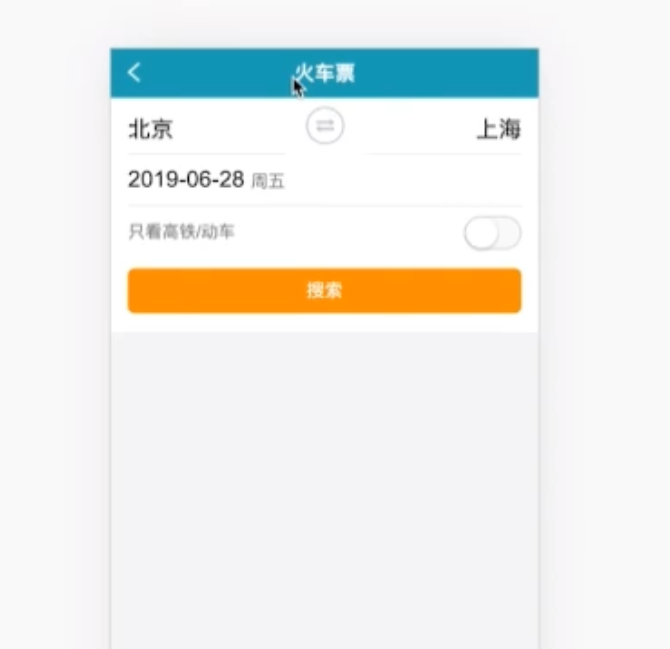

# 一个react-hooks技术栈的仿制去哪网项目

* [ ] 单页面转多页面应用
* [ ] 封装请求api
* [ ] 搭建mock

## 一：项目笔记

引入一个normalize.css  帮助我们适配个个浏览器的默认样式

### 1.1 首页的开发🚀️

- react 视觉组件拆分
- react store 状态涉及
- redux action/reducer设计

#### 1.1.1 拆分

公共组件和私有组件

- 除了标题可以是一个做成一个公共组件之外其他都是这个首页的私有组件

设计状态数据

- 需要被放进store里面的（因为这个是个多页面应用，状态几乎都不是用常规的组件往下传，把当前页面的所有状态放进store无疑是一个好的方式）
  - 起始地址、终止地址、显示城市浮层开关
  - 日期、显示日期浮层开关
  - 高铁or动车开关
